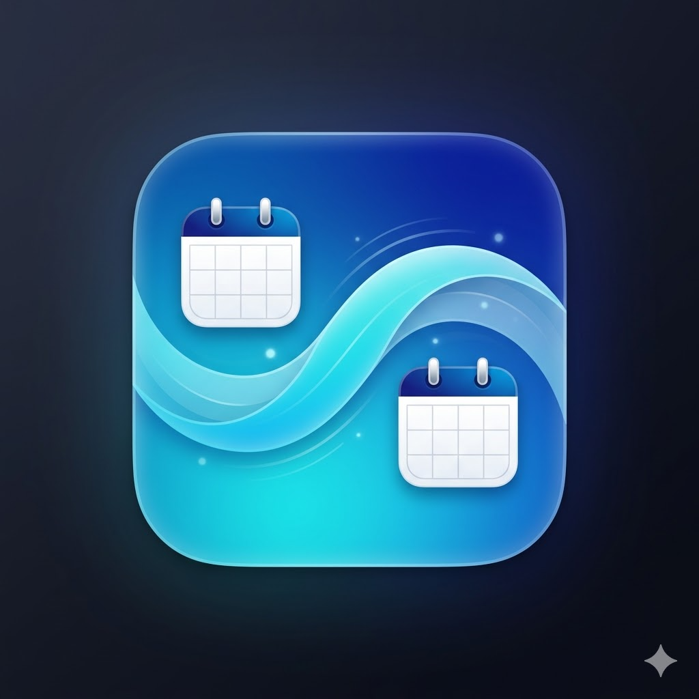

# EventFlow

<p align="center"></p>

Your Exchange calendar, on your iPhone — without IT involvement.

EventFlow copies events from your Exchange calendar (added via the iOS Calendar app) into iCloud, so they show up in any calendar app you already use. No admin permissions needed, no server, no setup beyond the app.

## Features

- One-tap manual sync
- Background refresh every ~30 minutes (controlled by iOS)
- Apple Shortcuts integration — trigger sync from automations
- Persisted calendar selection across app restarts
- No external dependencies, no server, no Azure admin permissions needed

## Requirements

- iOS 17+
- Xcode 15+
- Apple Developer account (free account works for personal device deployment)

## Deploy to iPhone

### 1. Configure signing

1. Open `EventFlow.xcodeproj` in Xcode
2. Select the **EventFlow** target
3. Go to **Signing & Capabilities**
4. Check **Automatically manage signing**
5. Select your **Team** (your Apple ID — add one via Xcode → Settings → Accounts if needed)
6. If the bundle ID `com.m-shammout.EventFlow` is taken, change it to something unique (e.g. `com.yourname.EventFlow`)

### 2. Build & run

1. Connect your iPhone via USB (or use wireless debugging if already paired)
2. Select your iPhone as the run destination in the Xcode toolbar
3. Press **Cmd+R** to build and run

### 3. Trust the developer profile (first time only)

If you see **"The application could not be launched because the Developer App Certificate is not trusted"**, you need to trust the certificate on your iPhone:

1. Go to **Settings → General → VPN & Device Management**
2. Tap your developer profile (your Apple ID)
3. Tap **Trust**

### 4. Grant calendar access

On first launch the app asks for full calendar access. Grant it — without this, nothing works.

## Usage

1. **Select calendars** — pick your Exchange calendar as source and an iCloud calendar as destination
2. **Tap "Sync Now"** — copies upcoming events (next 30 days) from source to destination
3. Events already synced are skipped (tracked via a marker in the notes field)

### Apple Shortcuts

The app registers a **"Sync Calendars"** action in Apple Shortcuts. You can use it in:

- **Time-based automations** (e.g. every morning at 7:00)
- **Focus mode triggers** (e.g. when Work focus activates)
- **NFC tags, widgets, or manual shortcuts**

To set it up: open the Shortcuts app → New Automation → choose your trigger → add the "Sync Calendars" action from EventFlow.

## Known Limitations

- **iOS 18.4+ bug**: `EKEventStore.save()` throws "Access denied" for recurring events with alarms — alarms are not copied as a workaround
- **Background refresh** frequency is controlled by iOS, not the app — the Shortcuts integration is a more reliable alternative
- **One-way sync only**: new events are added, existing events are not updated or deleted
- **MDM-managed Exchange** accounts may block EventKit access entirely

## Project Structure

```
EventFlow/
├── EventFlow.xcodeproj/
├── Info.plist                    # Permissions + BGTask identifier
└── EventFlow/
    ├── EventFlowApp.swift     # Entry point + BGTask registration
    ├── ContentView.swift         # UI: calendar pickers, sync button, status
    ├── EventFlowService.swift # Core sync logic (actor)
    ├── SyncStore.swift           # @Observable state + calendar loading + persistence
    └── SyncIntent.swift          # AppIntent for Apple Shortcuts
```

## License

Personal use.

---

Built with [Claude Code](https://claude.ai/code)
